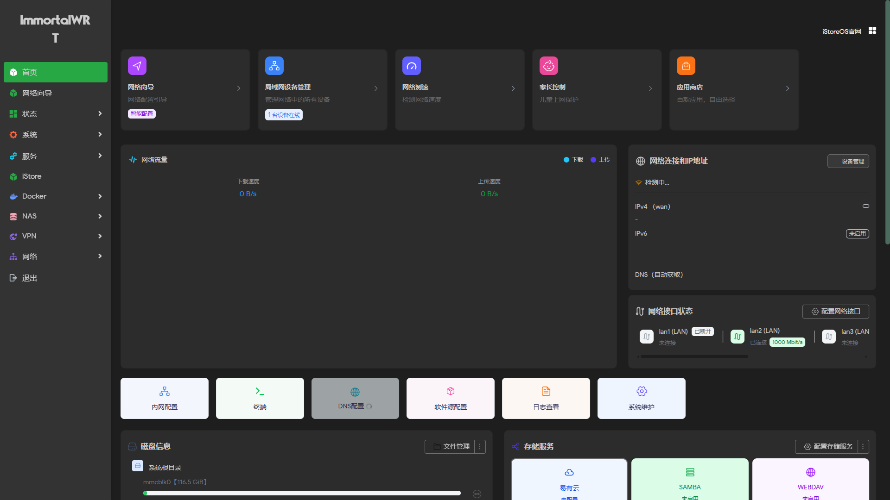

***

## 1. 项目信息

- **参考脚本**：<https://github.com/ZqinKing/wrt_release.git>
- **源码来源**：<https://github.com/VIKINGYFY/immortalwrt.git> - main
- **设备支持**：Link\_NN6000V2，内核分区 12m（固件包含带 WiFi 和不带 WiFi 版本）
- **固件发布**：每七天发布一次，包含最新源码和插件。[点击下载](https://github.com/wzdddyy/Link_NN6000V2/releases/latest)

***

## 2. 固件配置

### 2.1 系统配置

| 配置项          | 默认值         | 说明                                       |
| ------------ | ----------- | ---------------------------------------- |
| **LAN IP**   | `192.168.2.1` | (nn6000v2/scripts/update.sh) |
| **WiFi 名称**  | `NN6000`（2.4G）/ `NN6000_5G`（5G） | (nn6000v2/patches/992\_network\_config.sh) |
| **WiFi 密码**  | `12345679` | 加密方式 WPA2-PSK |
| **WiFi 状态**  | **默认开启** | 有 WiFi 固件首次启动自动开启 |
| **PPPoE 账号** | **未配置**     | (nn6000v2/patches/992\_network\_config.sh)    |
| **PPPoE 状态** | **自动拨号**    | 配置账号密码后自动拨号，无需手动开启                                 |

***

### 2.2 预装插件（6 个）

| 插件名称                     | 功能说明          |
| ------------------------ | ------------- |
| **luci-app-argon**       | Argon 主题      |
| **luci-app-autoreboot**  | 定时重启          |
| **luci-app-tailscale-community**    | Tailscale 虚拟组网 |
| **luci-app-ttyd**        | 终端            |
| **luci-app-homeproxy**   | 科学上网          |
| **luci-app-wireguard**   | WireGuard VPN |

***

### 2.3 内核 eBPF / XDP 支持

固件内核已启用 XDP socket、cgroup BPF、kprobes 与 BTF（`/sys/kernel/btf/vmlinux`），
并预置 `kmod-sched-core` / `kmod-sched-bpf` / `kmod-xdp-sockets-diag`，
可直接安装 `dae` / `daed` 等 eBPF 透明代理插件，无需重新编译固件。

***

### 2.4 已移除插件

Docker、AdGuardHome、SmartDNS、SQM、UPnP、hd-idle、p910nd、EasyTier、Lucky、
OAF、QuickFile、Samba4、PBR、磁盘管理、iStore 应用商店（含 quickstart）及其专用依赖均已移除。

***

## 3. 插件来源

部分插件源自：<https://github.com/kenzok8/openwrt-packages>

***

## 4. 项目结构

```
Link_NN6000V2/
└── nn6000v2/              # 设备专用目录
    ├── configs/           # 固件配置文件目录
    ├── patches/           # 设备补丁目录
    │   ├── cpuusage       # CPU 使用率补丁
    │   ├── hnatusage      # HNA 使用率补丁
    │   ├── smp_affinity   # SMP 中断平衡补丁
    │   └── tempinfo       # 温度信息补丁
    └── scripts/           # 编译脚本目录
        ├── build.sh       # 编译脚本
        ├── feeds.sh       # feeds 配置脚本
        ├── general.sh     # 通用设置脚本
        ├── packages.sh    # 包管理脚本
        ├── system.sh      # 系统配置脚本
        └── update.sh      # 更新脚本
```

***

## ImmortalWrt

<div align="center">



</div>

***

